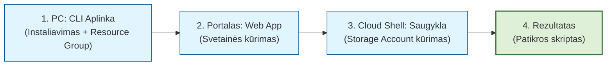

```mermaid
flowchart LR
    Step1["1. PC: CLI Aplinka<br>(Instaliavimas + Resource Group)"] --> Step2["2. Portalas: Web App<br>(Svetainės kūrimas)"]
    Step2 --> Step3["3. Cloud Shell: Saugykla<br>(Storage Account kūrimas)"]
    Step3 --> Step4["4. Rezultatas<br>(Patikros skriptas)"]

    style Step1 fill:#e1f5fe,stroke:#01579b
    style Step2 fill:#e1f5fe,stroke:#01579b
    style Step3 fill:#e1f5fe,stroke:#01579b
    style Step4 fill:#dff0d8,stroke:#3c763d,stroke-width:2px
```