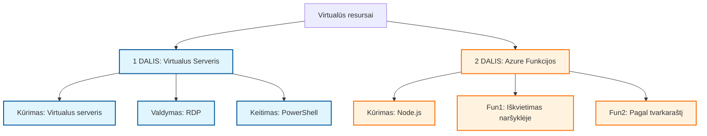

```mermaid
---
config:
  layout: fixed
---
flowchart TB
    Lab["Virtualūs resursai"] --> Part1["1 DALIS: Virtualus Serveris"] & Part2["2 DALIS: Azure Funkcijos"]
    Part1 --> A1["Kūrimas: Virtualus serveris"] & A2["Valdymas: RDP"] & A3["Keitimas: PowerShell"]
    Part2 --> B1["Kūrimas: Node.js"] & B2["Fun1: Iškvietimas naršyklėje"] & B3["Fun2: Pagal tvarkaraštį"]

     Part1:::vm
     Part2:::func
     A1:::vm
     A2:::vm
     A3:::vm
     B1:::func
     B2:::func
     B3:::func
    classDef vm fill:#e1f5fe,stroke:#01579b,stroke-width:2px
    classDef func fill:#fff3e0,stroke:#ff6f00,stroke-width:2px
    classDef user fill:#e8f5e9,stroke:#2e7d32,stroke-width:2px,rx:10,ry:10
```