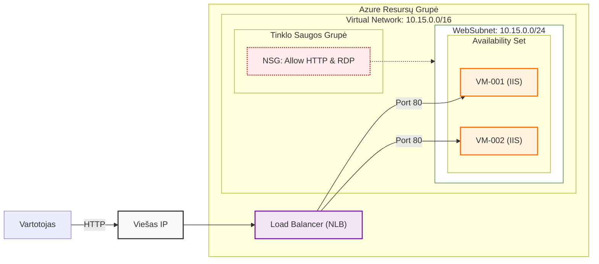

```mermaid
---
config:
  layout: dagre
---
flowchart LR
 subgraph NSG_Box["Tinklo Saugos Grupė"]
        NSG["NSG: Allow HTTP & RDP"]
  end
 subgraph AvSet["Availability Set"]
    direction LR
        VM1["VM-001 (IIS)"]
        VM2["VM-002 (IIS)"]
  end
 subgraph Subnet["WebSubnet: 10.15.0.0/24"]
    direction TB
        AvSet
  end
 subgraph VNet["Virtual Network: 10.15.0.0/16"]
    direction TB
        NSG_Box
        Subnet
  end
 subgraph AzureCloud["Azure Resursų Grupė"]
    direction TB
        LB["Load Balancer (NLB)"]
        VNet
  end
    User["Vartotojas"] -- HTTP --> PublicIP["Viešas IP"]
    PublicIP --> LB
    LB -- Port 80 --> VM1 & VM2
    NSG -.-> Subnet

     NSG:::nsg
     VM1:::vm
     VM2:::vm
     Subnet:::subnet
     LB:::lb
     PublicIP:::internet
    classDef internet fill:#f9f9f9,stroke:#333,stroke-width:2px
    classDef azure fill:#e1f5fe,stroke:#01579b,stroke-width:2px
    classDef vnet fill:#e8f5e9,stroke:#2e7d32,stroke-width:2px,stroke-dasharray: 5 5
    classDef subnet fill:#ffffff,stroke:#2e7d32,stroke-width:1px
    classDef vm fill:#fff3e0,stroke:#ff6f00,stroke-width:2px
    classDef lb fill:#f3e5f5,stroke:#7b1fa2,stroke-width:2px
    classDef nsg fill:#ffebee,stroke:#c62828,stroke-width:2px,stroke-dasharray: 2 2
```