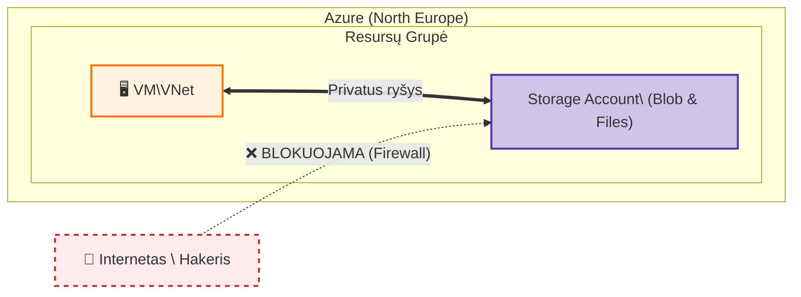

```mermaid
flowchart LR
    %% Stiliai
    classDef vm fill:#fff3e0,stroke:#ff6f00,stroke-width:2px;
    classDef storage fill:#d1c4e9,stroke:#512da8,stroke-width:2px;
    classDef internet fill:#ffebee,stroke:#c62828,stroke-width:2px,stroke-dasharray: 5 5;

    subgraph Azure ["Azure (North Europe)"]
        subgraph RG ["Resursų Grupė"]
            VM["🖥️ VM\VNet"]:::vm
            SA["Storage Account\ (Blob & Files)"]:::storage
        end
        VM <==>|"Privatus ryšys"| SA
    end

    User["👤 Internetas \ Hakeris"]:::internet
    User -.->|"❌ BLOKUOJAMA (Firewall)"| SA
```