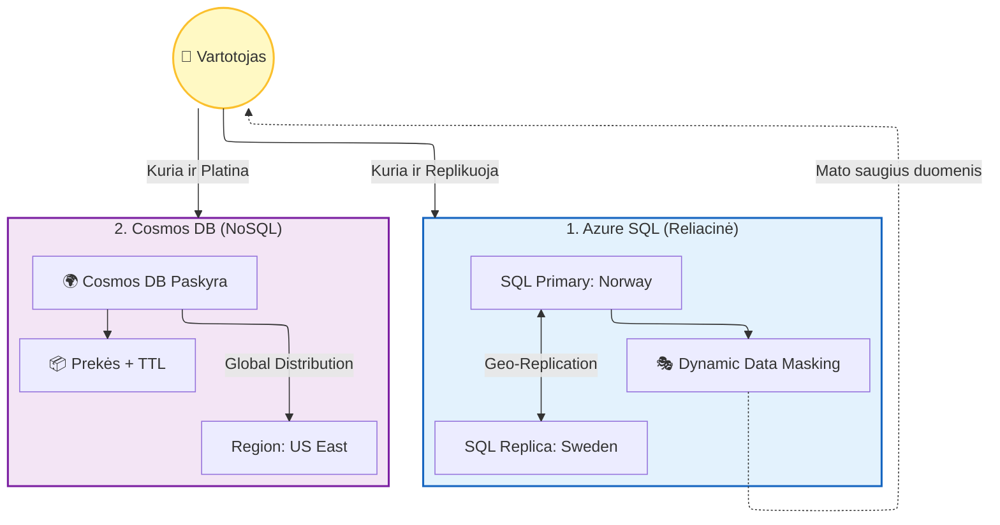

```mermaid
---
config:
  layout: elk
---
graph TD
    User((👤 Vartotojas))

    subgraph SQL_System ["1. Azure SQL (Reliacinė)"]
        SQL_Pri[SQL Primary: Norway] <-->|Geo-Replication| SQL_Sec[SQL Replica: Sweden]
        SQL_Pri --> Masking[🎭 Dynamic Data Masking]
    end

    subgraph NoSQL_System ["2. Cosmos DB (NoSQL)"]
        Cosmos[🌍 Cosmos DB Paskyra] -->|Global Distribution| US_Region[Region: US East]
        Cosmos --> Container[📦 Prekės + TTL]
    end

    User -->|Kuria ir Replikuoja| SQL_System
    Masking -.->|Mato saugius duomenis| User
    User -->|Kuria ir Platina| NoSQL_System
    style SQL_System fill:#e3f2fd,stroke:#1565c0,stroke-width:2px
    style NoSQL_System fill:#f3e5f5,stroke:#7b1fa2,stroke-width:2px
    style User fill:#fff9c4,stroke:#fbc02d,stroke-width:2px
```