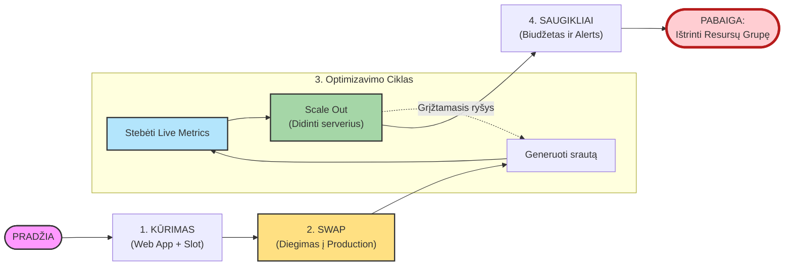

```mermaid
---
config:
  layout: dagre
---
flowchart LR
 subgraph subGraph0["3. Optimizavimo Ciklas"]
    direction TB
        Monitor["Stebėti Live Metrics"]
        Load["Generuoti srautą"]
        Scale["Scale Out<br>(Didinti serverius)"]
  end
    Start(["PRADŽIA"]) --> Init["1. KŪRIMAS<br>(Web App + Slot)"]
    Init --> Swap["2. SWAP<br>(Diegimas į Production)"]
    Load --> Monitor
    Monitor --> Scale
    Scale -. Grįžtamasis ryšys .-> Load
    Swap --> Load
    Scale --> Alerts["4. SAUGIKLIAI<br>(Biudžetas ir Alerts)"]
    Alerts --> Finish(["PABAIGA:<br>Ištrinti Resursų Grupę"])

    style Monitor fill:#b3e5fc,stroke:#333,stroke-width:2px
    style Scale fill:#a5d6a7,stroke:#333,stroke-width:2px
    style Start fill:#f9f,stroke:#333,stroke-width:2px
    style Swap fill:#ffe082,stroke:#333,stroke-width:2px
    style Finish fill:#ffcdd2,stroke:#b71c1c,stroke-width:4px
```