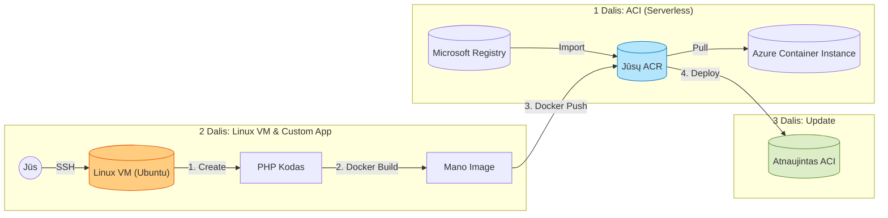

```mermaid
---
config:
  layout: dagre
---
flowchart LR
 subgraph subGraph0["1 Dalis: ACI (Serverless)"]
        ACR1[("Jūsų ACR")]
        MCR[("Microsoft Registry")]
        ACI[("Azure Container Instance")]
  end
 subgraph subGraph1["2 Dalis: Linux VM & Custom App"]
        VM[("Linux VM (Ubuntu)")]
        User(("Jūs"))
        Code["PHP Kodas"]
        Image["Mano Image"]
  end
 subgraph subGraph2["3 Dalis: Update"]
        ACI_FINAL[("Atnaujintas ACI")]
  end
    MCR -- Import --> ACR1
    ACR1 -- Pull --> ACI
    User -- SSH --> VM
    VM -- "1. Create" --> Code
    Code -- "2. Docker Build" --> Image
    Image -- "3. Docker Push" --> ACR1
    ACR1 -- "4. Deploy" --> ACI_FINAL

    style ACR1 fill:#b3e5fc,stroke:#0277bd
    style VM fill:#ffcc80,stroke:#e65100
    style ACI_FINAL fill:#dcedc8,stroke:#558b2f
```