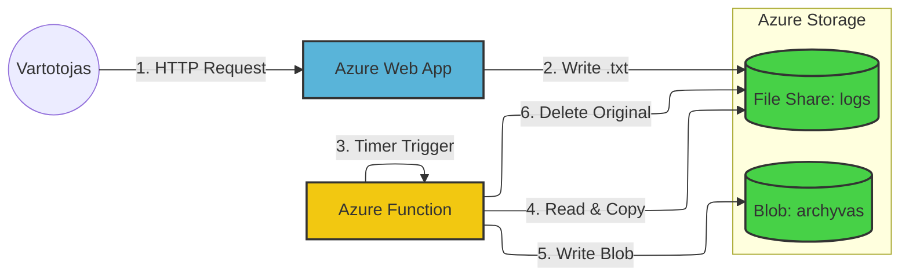

```mermaid
---
config:
  layout: elk
---
graph LR
    User((Vartotojas)) -- 1. HTTP Request --> WebApp[Azure Web App]
    
    subgraph "Azure Storage"
        FileShare[("File Share: logs")]
        BlobCont[("Blob: archyvas")]
    end
    
    WebApp -- 2. Write .txt --> FileShare
    
    FuncApp[Azure Function] -- 3. Timer Trigger --> FuncApp
    
    FuncApp -- 4. Read & Copy --> FileShare
    FuncApp -- 5. Write Blob --> BlobCont
    FuncApp -- 6. Delete Original --> FileShare

    style WebApp fill:#59b4d9,stroke:#333,stroke-width:2px
    style FuncApp fill:#f2c811,stroke:#333,stroke-width:2px
    style FileShare fill:#47d147,stroke:#333,stroke-width:2px
    style BlobCont fill:#47d147,stroke:#333,stroke-width:2px
```