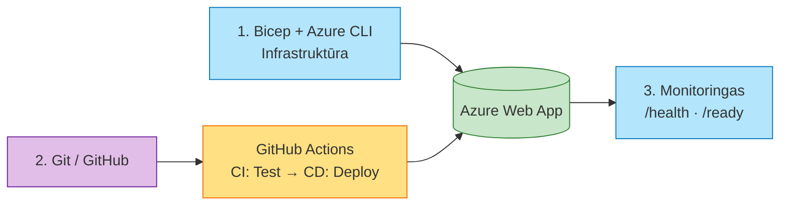

```mermaid
---
config:
  layout: dagre
---
flowchart LR
    Bicep["1. Bicep + Azure CLI<br/>Infrastruktūra"]
    Git["2. Git / GitHub"]
    Actions["GitHub Actions<br/>CI: Test → CD: Deploy"]
    Web[("Azure Web App")]
    Monitor["3. Monitoringas<br/>/health · /ready"]

    Bicep --> Web
    Git --> Actions --> Web
    Web --> Monitor

    style Bicep fill:#b3e5fc,stroke:#0277bd
    style Git fill:#e1bee7,stroke:#6a1b9a
    style Actions fill:#ffe082,stroke:#ef6c00
    style Web fill:#c8e6c9,stroke:#2e7d32
    style Monitor fill:#b3e5fc,stroke:#0277bd
```